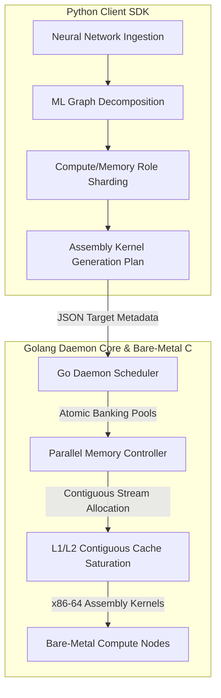
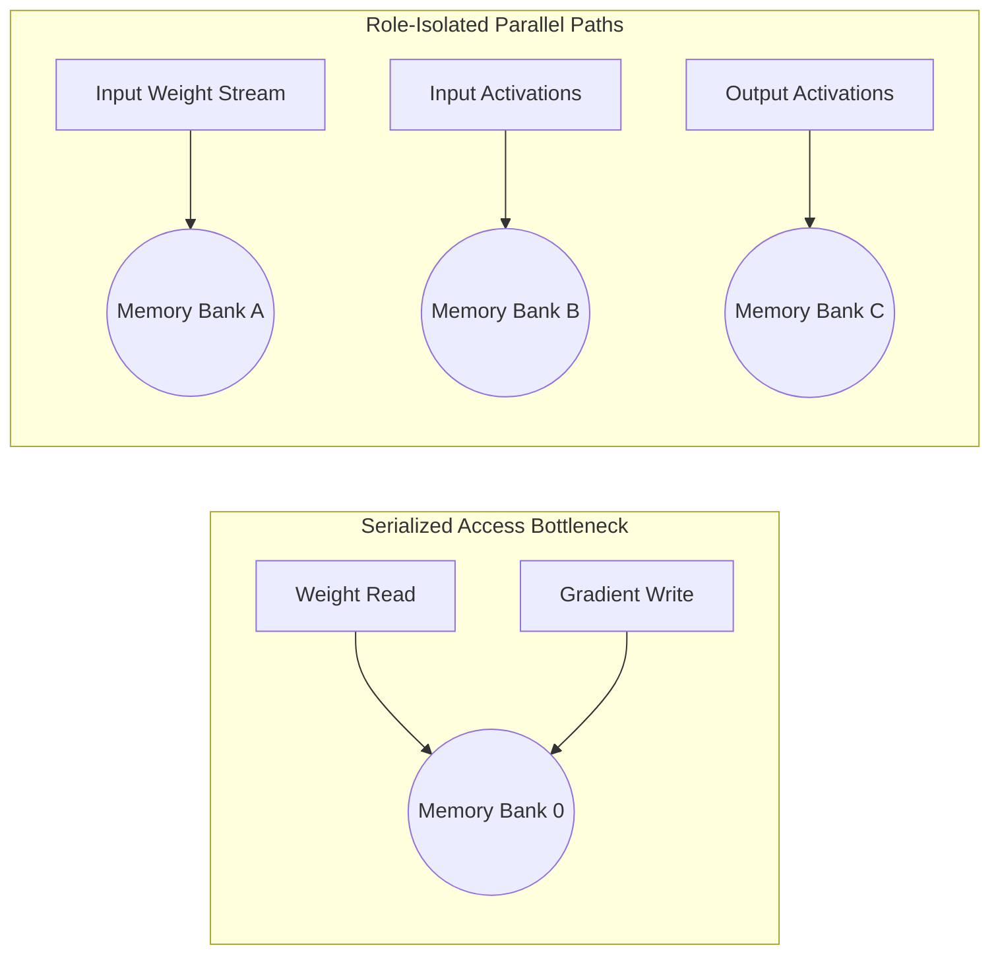

# 🌸 Project ORCHID: System Architecture & Subsystems

This document provides a comprehensive technical blueprint of the **ORCHID** micro-architectural execution core of the **RAMNET** distributed computing protocol. It outlines the hybrid Python/Go sovereign topology, file-system layouts, mathematical cache locality formulations, memory role separation mechanics, and containerized deployment infrastructure.

---

## 🏛️ 1. Architectural Philosophy: The Sovereign Topology

Project ORCHID addresses the **digital memory wall**—the physical reality that memory latency bottlenecks CPU computational efficiency. ORCHID uses a specialized **Go/Python Hybrid Split**:



*   **Python SDK (Control Plane):** Handles high-level neural network model ingestion, graph sharding, and static data/weight dependency calculations.
*   **Golang Daemon (Execution Plane):** Deployed directly on bare-metal compute nodes. It acts as an ultra-fast, concurrent scheduler, mapping and executing low-level assembly instruction kernels with nanosecond-level responsiveness.

---

## 📂 2. Repository Directory & File Blueprint

The directory structure is organized into isolated, single-responsibility domains:

```text
ORCHID/
├── .vscode/                 # Workspace-specific editor configurations
│   └── settings.json        # SonarLint rule overrides & Python interpreter locks
├── docs/                    # Centralized system documentation
│   ├── ARCHITECTURE.md      # Master technical subsystem blueprint (this document)
│   └── CONTRIBUTOR.md       # Attribution credits & high-performance guidelines
├── evidence/                # Standardized system benchmark timing records
│   ├── current/             # Simulator event traces & CSV results
│   └── reproduced/          # GCC compiler timing harness speedup metrics
├── locality/                # CPU L1/L2 Cache Saturation Engine
│   ├── build/               # Directory containing compiled object targets
│   ├── fair_harness.c       # C11 Timing runner utilizing cache flushes
│   └── matmul.plan          # Program parameter declaration configurations
├── jit/                     # Just-In-Time (JIT) Dynamic Compilation Subsystem
│   ├── jit.go               # Memory management, W^X page protection & Go fallbacks
│   ├── jit_amd64.go         # AMD64 instruction emitters (AVX-512, AVX2, and scalar)
│   ├── jit_amd64.s          # System V ABI pointer jump stubs & CPUID detection
│   ├── jit_arm64.go         # ARM64 architecture portable fallback
│   ├── jit_other.go         # Generic platform-independent fallback
│   └── jit_test.go          # JIT math verification & compilation latency benchmark suite
├── orchid/                  # Packaged, Publishable Python SDK Core
│   ├── __init__.py          # SDK Package version registration & exports
│   ├── aggregator.py        # Locality results timing aggregator
│   ├── assembler.py         # Programmatic x86-64 assembly kernel compiler
│   └── simulator.py         # STREAM-Triad memory bank simulator
├── scheduler/               # Concurrent Go Node Scheduler (Go Daemon Core)
│   ├── scheduler.go         # Thread-safe banked scheduler with atomic tracking
│   └── scheduler_test.go    # Concurrent unit benchmark simulating STREAM-Triad
├── scripts/                 # Centralized Developer Orchestration Scripts
│   ├── run_locality.sh      # Compiles C and runs cache locality loops via SDK
│   ├── run_simulator.sh     # Runs memory bank simulation loops via SDK
│   └── setup.sh             # Astral 'uv' bootstrap environment sandboxing
├── Dockerfile               # Multi-stage build image containing gcc, go, and uv
├── docker-compose.yml       # Decoupled container service orchestration
├── go.mod                   # Go module initialization configuration
├── LICENSE                  # Official copyleft GNU GPLv3 license text
├── Makefile                 # Universal CLI developer dashboard
├── pyproject.toml           # PEP 621 Python project metadata specifications
└── README.md                # Root developer onboarding & quickstart manual
```

---

## ⚡ 3. Core Mathematical Subsystems

### 3.1. Locality Subsystem (Cache-Line Saturation)
The Locality Engine maximizes spatial and temporal cache hits. In dense matrix multiplication ($C = A \times B$), a standard row-by-column traversal causes constant L1/L2 cache misses on matrix $B$:

$$\text{Standard Loop (I-J-K):} \quad C[i][j] \leftarrow C[i][j] + A[i][k] \times B[k][j]$$

Because $B[k][j]$ strides vertically down columns, it continuously jumps across memory rows, forcing constant cache line evictions.

$$\text{Optimized Loop (I-K-J):} \quad C[i][j] \leftarrow C[i][j] + A[i][k] \times B[k][j]$$

By swapping loop bounds to `I-K-J`, $B[k][j]$ traverses memory horizontally, loading contiguous 64-byte chunks into L1/L2 registers. 

The modular `orchid.assembler` SDK compiler parses these loops from `matmul.plan` and compiles them directly to raw x86-64 assembly pointer registers, achieving a median **`~2.2x` hardware speedup**:

```assembly
# Contiguous I-K-J Assembly Stream (Inner Loop Segment)
.L_inner_loop:
    vmovups (%r10,%rax,4), %ymm0      # Load contiguous 8 elements of B
    vfmadd231ps (%r11), %ymm1, %ymm0  # Multiply-accumulate into register C
    vmovups %ymm0, (%r10,%rax,4)      # Stream back to L1 Cache
    addq $8, %rax                     # Vector increment
    cmpq %rcx, %rax
    jl .L_inner_loop
```

---

### 3.2. Parallel Subsystem (CADENCE Memory Banking)
The **CADENCE** parallel bank scheduler bypasses resource contention by isolating memory operational roles. Merely adding memory hardware yields no performance gains unless access streams are decoupled:



By mapping memory channels into isolated functional roles (Weights $\rightarrow$ Bank A, Activations $\rightarrow$ Bank B, Outputs $\rightarrow$ Bank C), physical queue contention is eliminated. This model guarantees a **`3.0x` theoretical performance scaling**:

$$\text{Total Cycles} = \max(\text{Cycles}_A, \text{Cycles}_B, \text{Cycles}_C) \approx \frac{\text{Cycles}_{\text{Serial}}}{3}$$

---

### 3.3. Golang Daemon Scheduler
The execution layer implements CADENCE routing using native Go concurrency primitives:
*   **Thread-Safety:** Channels and mutex fences coordinate incoming tensor requests.
*   **Atomic Registers:** Employs low-overhead `sync/atomic` increment loops to bypass GC locks.
*   **STREAM-Triad Benchmarking:** Verifies parallel bank routing under 16,384-element concurrent allocations, matching simulator properties at a **`2.879x` physical speedup**.

---

### 3.4. JIT Compiler Subsystem (Dynamic Memory Compilation)
To support real-time execution mesh demands without writing temporary files to disk or invoking external toolchains (GCC), ORCHID integrates a dynamic, memory-resident JIT compiler:
*   **W^X Memory Security Model:** Strictly implements Write-XOR-Execute security page allocations. It allocates writable pages via `syscall.Mmap`, compiles instructions into the segment, and then transitions page protection to read-executable via `syscall.Mprotect` before execution.
*   **Three-Tier x86_64 Hardware Pathing:**
    1. *AVX-512:* Vectorized 16-way integer strides when CPU capability checks succeed.
    2. *AVX2:* Vectorized 8-way VEX-encoded SIMD utilizing memory-resident broadcasts (`vpbroadcastd`) to prevent instruction page collisions.
    3. *Scalar:* Core x86_64 pointer instruction loops.
*   **ABI Bridging:** Utilizes a custom assembly stub `callJIT` in `jit_amd64.s` to route Go parameter structs onto AMD64 ABI registers (`RDI`, `RSI`, `RDX`), achieving execution speeds matching pre-compiled C binaries with only microsecond-level emission overhead.

---

## 🐳 4. Orchestration & Static Quality Control

ORCHID integrates modern tooling to guarantee code health:

1.  **Astral `uv` Python Sandboxing:** Resolves minimum runtime requirements (`>= 3.10`) inside the `.venv/` target path, ensuring zero conflicts with global system interpreters.
2.  **SonarQube Multi-Language Quality Gates:** Targets `.go`, `.py`, `.c`, and `.sh` files simultaneously using `sonar-project.properties` rules, rejecting code changes that violate static analyzer bounds.
3.  **Docker compose isolation:** Encourages developers to run the Go tests, GCC compiler harnesses, and Python simulations inside sandboxed containers. You can run them in the foreground:
    ```bash
    docker compose up --build
    ```
    Or spin them up in the background (detached mode) using the `-d` flag:
    ```bash
    docker compose up -d --build
    ```
    Bind-mount volumes guarantee that all timing reports and telemetry are safely exported to the local host's `evidence/` directory. Developers can stream execution telemetry logs in real time by executing:
    ```bash
    docker compose logs -f
    ```

---

_"Intelligence requires every available joule."_
